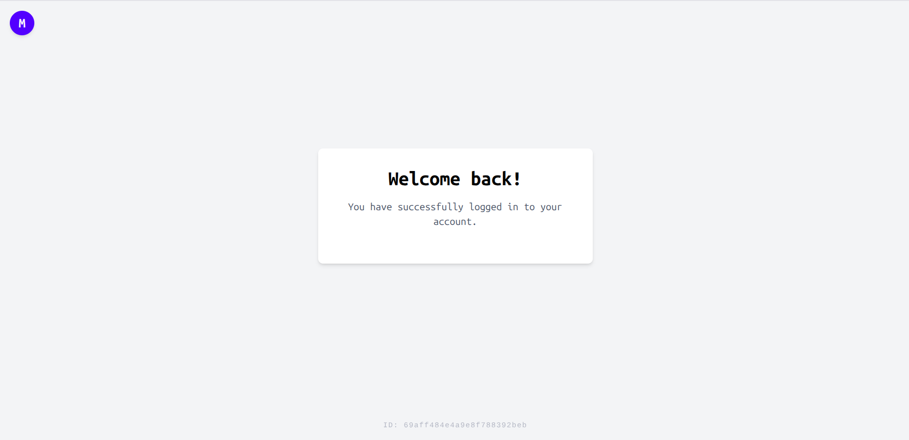

# MERN Authentication Flow with TanStack Query and Tailwind

A complete MERN (MongoDB, Express, React, Node.js) stack project demonstrating a robust authentication and authorization flow. It includes secure registration, email verification, login functionality, and protected routes using modern React tools.

## Features

*   **Backend (Node.js/Express):**
    *   **MongoDB & Mongoose:** Connects to a MongoDB database (local or Atlas) for user data storage.
    *   **Secure Authentication:** Uses `bcryptjs` for password hashing and `jsonwebtoken` (JWT) for session management.
    *   **Email Verification Flow:** Generates unique tokens upon registration to verify email addresses before allowing login.
    *   **Protected Routes:** Custom middleware to verify JWT tokens and secure API endpoints.
*   **Frontend (React/Vite):**
    *   **Vite Setup:** Fast local development environment and optimized production builds.
    *   **React Router v7:** Client-side routing with protected route components.
    *   **TanStack Query (React Query):** Effortless server-state management, caching, and loading/error handling for API requests.
    *   **TailwindCSS v4:** Utility-first styling for a clean, modern UI.
    *   **Axios Interceptors:** Automatically attaches the JWT token to outgoing protected requests.

## Getting Started

### Prerequisites

*   Node.js installed on your machine.
*   MongoDB installed locally (default setup uses `mongodb://localhost:27017/sheryians_task`) or a MongoDB Atlas URI.

### Environment Setup

1.  Clone the repository:
    ```bash
    git clone https://github.com/Mrinal-Agrawal21/Shery_task_interview.git
    cd Shery_task_interview
    ```

### Backend Setup (Server)

1.  Navigate to the server directory:
    ```bash
    cd server
    ```
2.  Install dependencies:
    ```bash
    npm install
    ```
3.  Start the backend server:
    ```bash
    npm run dev
    # (Or `node index.js` if you are not using nodemon)
    ```
    *The server runs on `http://localhost:5000/api` by default.*

### Frontend Setup (Client)

1.  Open a new terminal and navigate to the client directory:
    ```bash
    cd client
    ```
2.  Install dependencies:
    ```bash
    npm install
    ```
3.  Start the Vite development server:
    ```bash
    npm run dev
    ```
    *The client runs on `http://localhost:5173/` by default.*

## Application Flow

1.  **Register:** A user accesses the `/register` page and creates an account. The backend safely hashes the password and generates an email verification link (logged to the backend console).
2.  **Verify:** The user clicks the link (e.g., `http://localhost:5173/verify-email?token=...`) which automatically calls the `/verify-email` endpoint.
3.  **Login:** The user logs in at `/login`. A JWT token is stored in `localStorage`.
4.  **Profile:** The user is redirected to the `/profile` page, managed securely by TanStack Query and an Axios Request Interceptor. If the user logs out, the token is cleared, and access is revoked.

## Screenshots


